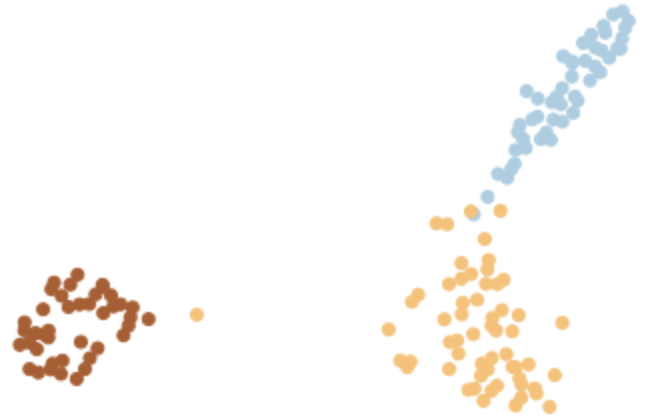

# Metric-Based-Learning
In this question, we are going to investigate the impact of metric-based learning methods on the k-nearest neighbors classifier.


First, we implement the KNN classifier from scratch:

```python
def KNN_Classifier (x_train, y_train, x_test, k):
    yhat = []
    overall_class_list = []
    for i in range(len(x_test)):
        x_t = x_test.iloc[i]
        distance_list = []
        index_list = []
        for j in range(len(x_train)):
            second_data = x_train.iloc[j]
            distance_list.append(dist(x_t,second_data))
            index_list.append(j)
        distance = pd.DataFrame(distance_list, columns = ['distance'])
        index = pd.DataFrame(index_list, columns = ['index'])
        result = pd.concat([distance, index], axis=1)
        result_sorted = result.sort_values(by = 'distance')
        index_list = list(result_sorted['index'][:k])
        distance = list(result_sorted['distance'][:k])
        class_list = []
        for index in index_list:
            class_list.append(y_train[index])
                
        overall_class_list.append(class_list)
        yhat.append(max(class_list,key=class_list.count))
    return yhat, overall_class_list
```

We split 20% of the dataset for testing and the remaining for training. For k-values of 1, 5, 10, and 20, we report the classifier's accuracy and confusion matrix on the test set:

For k = 1:

```
Accuracy =  74.35897435897436
Confusion Matrix: [[13, 0, 0], [1, 6, 3], [1, 5, 10]]
```


For k = 5:

```
Accuracy =  69.23076923076923
Confusion Matrix: [[13, 0, 0], [1, 7, 6], [1, 4, 7]]
```

For k = 10:

```
Accuracy =  79.48717948717949
Confusion Matrix: [[13, 0, 0], [0, 7, 2], [2, 4, 11]]
```


For k = 20:

```
Accuracy =  76.92307692307692
Confusion Matrix: [[13, 0, 0], [0, 8, 4], [2, 3, 9]]
```


For the mentioned k-values, we plot the probability of class membership for the test set as shown in the diagrams below:

For k = 1:


For k = 5:


For k = 10:


For k = 20:


## Metric-based Learning Methods:

In this section, we apply two metric-based learning methods, ***LMNN*** (Large Margin Nearest Neighbor) and ***LFDA*** (Local Fisher Discriminant Analysis), to analyze their impact on data partitioning in a 2D space. Since the original dataset consists of 13 dimensions, we utilize the metric-learning library to transform the data into a new feature space. To further reduce dimensionality for visualization, we apply Principal Component Analysis (PCA), enabling us to observe the data's structure in a lower-dimensional space.


Initial data:


Initial Correlation Matrix:


Function to calculate LMNN:

```python
def LMNN_calc (x_train, y_train, x_test, K):
    lmnn = LMNN(k=K, n_components=2)
    lmnn.fit(x_train, y_train)
    x_train_new = lmnn.transform(x_train)
    x_test_new = lmnn.transform(x_test)
    return x_train_new, x_test_new
```

After reducing the dimensionality of the original and transformed datasets, for three different k-values (1, 5, 15), we plot and analyze how well the data from each class is separated from other classes. 

For k = 1:


For k = 5:



For k = 15:


As it can be seen from the plots above, the best classification happens for k = 15.

For k-values of 1, 5, 10, and 20 in the knn classifier in the transformed space, We measure the accuracy, confusion matrix, and the correlation coefficient matrix For the best k-value obtained from the previous section (k=15):

For k = 1:

```
Accuracy =  1.0
Confusion Matrix: array([[10,  0,  0],
       [ 0, 13,  0],
       [ 0,  0,  7]])
```

For k = 5:

```
Accuracy =  0.9666666666666667
Confusion Matrix: array([[10,  0,  0],
       [ 1, 12,  0],
       [ 0,  0,  7]])
```

For k = 10:

```
Accuracy =  0.9666666666666667
Confusion Matrix: array([[10,  0,  0],
       [ 1, 12,  0],
       [ 0,  0,  7]])
```


For k = 20:

```
Accuracy =  1.0
Confusion Matrix: array([[10,  0,  0],
       [ 0, 13,  0],
       [ 0,  0,  7]])
```

Correlation Matrix after applying LMNN:


Function to calculate LFDA:

```python
def LFDA_calc (x_train, y_train, x_test, K):
    lfda = LFDA(k=K, n_components=2)
    lfda.fit(x_train, y_train)
    x_train_new = lfda.transform(x_train)
    x_test_new = lfda.transform(x_test)
    return x_train_new, x_test_new
```

After reducing the dimensionality of the original and transformed datasets, for three different k-values (1, 5, 15), we plot and analyze how well the data from each class is separated from other classes. 

For k = 1:


For k = 5:


For k = 15:


As it can be seen from the plots above, the best classification happens for k = 15.

For k-values of 1, 5, 10, and 20 in the knn classifier in the transformed space, We measure the accuracy, confusion matrix, and the correlation coefficient matrix For the best k-value obtained from the previous section (k=15):

For k = 1:

```
Accuracy =  1.0
array([[10,  0,  0],
       [ 0, 13,  0],
       [ 0,  0,  7]])
```

For k = 5:

```
Accuracy =  0.9666666666666667
Confusion Matrix:  array([[10,  0,  0],
       [ 1, 12,  0],
       [ 0,  0,  7]])
```

For k = 10:

```
Accuracy =  0.9743589743589743
Confusion Matrix:  array([[14,  1,  0],
       [ 0, 11,  0],
       [ 0,  0, 13]])
```


For k = 20:

```
Accuracy =  0.9666666666666667
Confusion Matrix:  array([[10,  0,  0],
       [ 1, 12,  0],
       [ 0,  0,  7]])
```

Correlation Matrix after applying LFDA:


